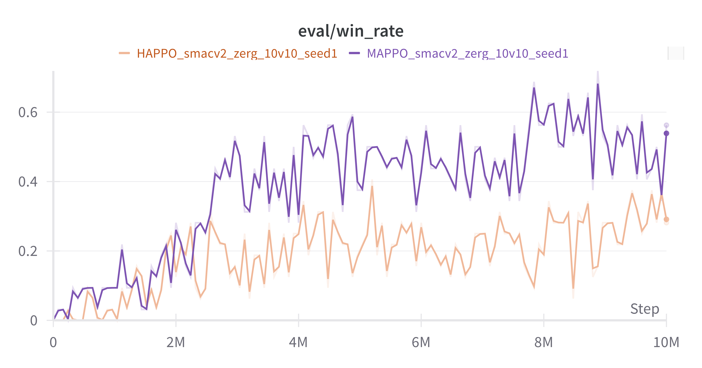

# Multi-Agent PPO Algorithms

[](https://api.wandb.ai/links/legalaspro-rl/agvdrt35)

<p align="center">
  
  
</p>
<p align="center">
  <em>MAPPO vs HAPPO performance comparison on SMACv2 zerg_10_vs_10 (left) and zerg_5_vs_5 (right) maps</em>
</p>

A collection of clean, documented, and straightforward implementations of PPO-based algorithms for cooperative multi-agent reinforcement learning, with a focus on the [StarCraft Multi-Agent Challenge (SMAC)](https://github.com/oxwhirl/smac) environment. The implementations include MAPPO (Multi-Agent PPO) based on the paper ["The Surprising Effectiveness of PPO in Cooperative Multi-Agent Games"](https://arxiv.org/abs/2103.01955) and HAPPO (Heterogeneous-Agent PPO) based on the paper ["Heterogeneous-Agent Proximal Policy Optimization"](https://jmlr.org/papers/v25/23-0488.html).

Currently implemented:

- **MAPPO**: Multi-Agent PPO with both MLP and RNN networks
  - **Light MAPPO**: Lightweight single-environment implementation with MLP networks
  - **Light RNN MAPPO**: Lightweight single-environment implementation with RNN networks
  - **Vectorized MAPPO**: Full implementation with support for parallel environments
- **HAPPO**: Heterogeneous-Agent PPO with agent-specific policies and vectorized environment support

Both MAPPO and HAPPO support:

- Vectorized environments using SubprocVecEnv and DummyVecEnv
- Recurrent networks for handling partial observability
- Various normalization techniques

Supported environments:

- **SMACv1**: Original StarCraft Multi-Agent Challenge environment
- **SMACv2**: Next generation SMAC with enhanced capabilities and team compositions

## Project Overview

This project began as a reimplementation of MAPPO (Multi-Agent Proximal Policy Optimization) with a focus on clarity, documentation, and reproducibility. The development journey started with a simple MLP-based MAPPO for single environments, and then expanded to include an RNN-based implementation following the approach described in the original MAPPO paper.

The project has now grown to include vectorized implementations for parallel environments, HAPPO (Heterogeneous-Agent PPO), and support for both SMACv1 and SMACv2 environments. The vectorized implementation allows for more efficient training by running multiple environments in parallel, while HAPPO extends MAPPO by allowing agent-specific policies.

The goal is to provide readable and straightforward implementations that researchers and practitioners can easily understand and build upon. This repository serves as a comprehensive suite of cooperative multi-agent algorithms with a focus on PPO-based methods.

### Key Features

- **Clean Architecture**: Modular design with clear separation of concerns
- **Comprehensive Documentation**: Well-documented code with detailed comments
- **Flexible Implementation**: Support for both MLP and RNN-based policies
- **Normalization Options**: Multiple value and reward normalization techniques
- **Performance Optimizations**: Improved learning speed and stability
- **Detailed Logging**: Comprehensive logging and visualization support
- **Environment Vectorization**: Support for parallel environments using SubprocVecEnv and DummyVecEnv
- **HAPPO Implementation**: Heterogeneous-Agent PPO with agent-specific policies
- **SMACv2 Support**: Integration with the next generation StarCraft Multi-Agent Challenge
- **Installation Scripts**: Easy setup for StarCraft II and SMAC maps on both Linux and macOS
- **Thread Optimization**: Automatic setting of environment variables for optimal performance with parallel environments

## Installation

### Prerequisites

- Python 3.11 or higher

### Setup

1. Clone the repository:

   ```bash
   git clone https://github.com/legalaspro/marl-ppo-suite.git
   cd marl-ppo-suite
   ```

2. Create and activate the conda environment:
   ```bash
   conda env create -f environment.yml
   conda activate marl-ppo-suite
   ```

### SMAC Installation

The StarCraft Multi-Agent Challenge (SMAC) requires StarCraft II to be installed, along with the SMAC maps. We provide installation scripts for both Linux and macOS that automate this process:

#### Automated Installation (Recommended)

1. For Linux:

   ```bash
   chmod +x install_smac_linux.sh
   ./install_smac_linux.sh
   ```

2. For macOS:

   ```bash
   chmod +x install_smac_mac.sh
   ./install_smac_mac.sh
   ```

These scripts will:

- Check if StarCraft II is installed, and install it if not
- Download and install the SMAC maps to the correct location
- Set up the necessary environment

#### Manual Installation

If you prefer to install manually, follow these steps:

1. Install StarCraft II (version 4.10):

   - [Linux](https://github.com/Blizzard/s2client-proto#downloads)
   - [Windows](https://starcraft2.com/)
   - [macOS](https://starcraft2.com/)

2. Download SMAC Maps:

   ```bash
   # SMACv2 maps include all SMACv1 maps, so you only need to download SMACv2 maps
   wget -q https://github.com/oxwhirl/smacv2/releases/download/maps/SMAC_Maps.zip
   unzip SMAC_Maps.zip -d /path/to/StarCraftII/Maps/
   ```

   Replace `/path/to/StarCraftII/` with your StarCraft II installation directory.

3. For SMACv2, install the Python package:

   ```bash
   pip install git+https://github.com/oxwhirl/smacv2.git
   ```

4. Set the StarCraft II environment variable (optional but recommended):

   ```bash
   # Linux/macOS
   export SC2PATH=/path/to/StarCraftII/

   # Windows
   set SC2PATH=C:\path\to\StarCraftII\
   ```

   You can add this to your shell profile for persistence.

For more detailed instructions, refer to the [official SMAC documentation](https://github.com/oxwhirl/smac) or [SMACv2 documentation](https://github.com/oxwhirl/smacv2).

## Usage

### Training

To train an agent on the SMAC environment:

```bash
# For vectorized MAPPO with SMACv1
python train.py --algo mappo --env_name smacv1 --map_name 3m

# For vectorized MAPPO with RNN networks
python train.py --algo mappo --use_rnn --env_name smacv1 --map_name 3m

# For vectorized HAPPO with SMACv1
python train.py --algo happo --env_name smacv1 --map_name 3m

# For vectorized MAPPO with SMACv2
python train.py --algo mappo --env_name smacv2 --map_name 3m

# For vectorized training with multiple environments
python train.py --algo mappo --env_name smacv1 --map_name 3m --n_rollout_threads 8

# For lightweight single-environment implementations
python light_train.py --algo mappo --map_name 3m
python light_train.py --algo mappo_rnn --map_name 3m
```

### Cloud Deployment

For training on cloud platforms, we provide deployment scripts and configurations in the `cloud` directory:

```bash
# Build and test Docker image locally
./cloud/build_and_push.sh --test

# Build with version tag and push to Docker Hub
./cloud/build_and_push.sh --tag v1.0.0 --test --push
```

We support two deployment approaches:

1. **Containerized Deployment (RunPods.io)**: Docker-based deployment for GPU cloud platforms
2. **Standalone Deployment**: Direct installation on any Linux machine (Hetzner, AWS, GCP, etc.)

For detailed instructions, see the [Cloud Deployment Guide](cloud/README.md).

The lightweight implementations (`light_train.py`) are optimized for single-environment training and have a simpler codebase, making them easier to understand and modify. The full implementations (`train.py`) support vectorized environments and more advanced features.

#### Key Arguments

- `--algo`: Algorithm to use (`mappo` or `happo`)
- `--env_name`: Environment to use (`smacv1` or `smacv2`)
- `--map_name`: SMAC map to run on (e.g., `3m`, `8m`, `2s3z` for SMACv1, or `terran_10_vs_10` for SMACv2)
- `--n_rollout_threads`: Number of parallel environments for training (default: 1)
- `--n_eval_rollout_threads`: Number of parallel environments for evaluation (default: 1)
- `--n_steps`: Number of steps per rollout
- `--ppo_epoch`: Number of PPO epochs
- `--use_rnn`: Enable recurrent networks (default: False)
- `--use_value_norm`: Enable value normalization (default: False)
- `--value_norm_type`: Type of value normalizer (`welford` or `ema`)
- `--use_reward_norm`: Enable reward normalization (default: True)
- `--reward_norm_type`: Type of reward normalizer (`efficient` or `ema`)
- `--state_type`: Type of state representation (`FP`, `EP`, or `AS`)
- `--fixed_order`: Use fixed agent order for HAPPO updates (default: False)
- `--use_wandb`: Enable Weights & Biases logging (default: False)

For a full list of arguments, run:

```bash
python train.py --help
```

### Model Evaluation, Rendering, and Downloading

#### Evaluating Trained Models

To evaluate a trained model:

```bash
# Evaluate during training
python train.py --algo mappo --env_name smacv1 --map_name 3m --mode eval

# Evaluate a specific saved model
python train.py --algo mappo --env_name smacv1 --map_name 3m --mode eval --model path/to/model
```

#### Rendering Agent Behavior

To visualize agent behavior:

```bash
# Render a trained model
python train.py --algo mappo --env_name smacv1 --map_name 3m --mode render --model path/to/model
```

#### Downloading Models from Weights & Biases

We provide a utility script to download trained models from Weights & Biases:

```bash
# Download model from a specific run
python wandb_download.py --run_id n2x9y78f

# Use the downloaded model (the script will suggest the exact command)
python train.py --mode eval --config ./artifacts/mappo_smacv1_3m_n2x9y78f/config.json --model ./artifacts/mappo_smacv1_3m_n2x9y78f/best_model
```

The script organizes downloaded models in folders by algorithm, environment, and map name for easy access.

### Using Vectorized Environments

The vectorized implementation allows running multiple environments in parallel for more efficient training:

```bash
# Run 8 environments in parallel for training
python train.py --algo mappo --env_name smacv1 --map_name 3m --n_rollout_threads 8

# Run 4 environments in parallel for evaluation
python train.py --algo mappo --env_name smacv1 --map_name 3m --use_eval --n_eval_rollout_threads 4
```

### Experiment Tracking with Weights & Biases

The implementation supports Weights & Biases (wandb) for experiment tracking:

```bash
# Enable wandb logging
python train.py --algo mappo --env_name smacv1 --map_name 3m --use_wandb
```

#### Setting Environment Variables

You can set environment variables directly in your terminal:

```bash
# Set wandb and performance variables
export WANDB_API_KEY=your_api_key_here
export WANDB_PROJECT=marl-ppo-suite
export WANDB_ENTITY=your_username_or_team
export OMP_NUM_THREADS=1
export MKL_NUM_THREADS=1
```

Or create a `.env` file in the project root:

```bash
# Create .env file
cat > .env << EOL
WANDB_API_KEY=your_api_key_here
WANDB_PROJECT=marl-ppo-suite
WANDB_ENTITY=your_username_or_team
OMP_NUM_THREADS=1
MKL_NUM_THREADS=1
EOL

# Load environment variables from .env file
source .env
```

This allows you to track training progress, compare different runs, and visualize results in the wandb dashboard.

### Performance Optimization

Since StarCraft II is primarily CPU-intensive, the implementation automatically sets the following environment variables to optimize performance when running multiple environments in parallel:

```python
if "MKL_NUM_THREADS" not in os.environ:
    os.environ["MKL_NUM_THREADS"] = "1"
if "OMP_NUM_THREADS" not in os.environ:
    os.environ["OMP_NUM_THREADS"] = "1"
```

These settings significantly improve performance when using `SubprocVecEnv` with StarCraft 2 environments by:

1. Preventing thread contention between parallel environments
2. Reducing overhead in numpy operations (which use MKL and OpenMP internally)
3. Ensuring each subprocess uses a single thread, avoiding resource competition

This optimization is particularly important for computationally intensive environments like StarCraft 2, where setting these variables can lead to dramatic performance improvements (almost 2.5x speedup) when running multiple environments in parallel.

For optimal performance, you should adjust `n_rollout_threads` based on your CPU core count:

- For 8-core systems: 8-12 threads
- For 16-core systems: 16-24 threads

## Project Structure

```
mappo/
├── algos/                      # Algorithm implementations
│   ├── mappo/                  # MAPPO implementation (vectorized)
│   ├── happo/                  # HAPPO implementation (vectorized)
│   ├── light_mappo.py          # Lightweight MAPPO implementation
│   └── light_rnn_mappo.py      # Lightweight RNN MAPPO implementation
├── buffers/                    # Replay buffer implementations
│   ├── rollout_storage.py      # Buffer for vectorized implementations
│   ├── light_rollout_storage.py # Buffer for lightweight MAPPO
│   └── light_rnn_rollout_storage.py # Buffer for lightweight RNN MAPPO
├── cloud/                      # Cloud deployment scripts and configurations
│   ├── train.sh                # Main script for running training on cloud
│   ├── train_simple.sh         # Simplified script for cloud training
│   ├── build_and_push.sh       # CI/CD-friendly script for building and pushing Docker images
│   ├── docker-compose.yml      # Docker Compose configuration
│   ├── examples/               # Example scripts and configurations
│   ├── runpods/                # RunPods.io specific files
│   │   ├── Dockerfile          # Docker configuration for RunPods.io
│   │   └── entrypoint.sh       # Container entrypoint script
│   └── standalone/             # Standalone deployment files for any Linux machine
│       ├── server_setup.sh     # Initial server setup and system dependencies
│       ├── app_setup.sh        # Repository and environment setup
│       ├── run_experiments.sh  # Script for running multiple experiments
│       └── tmux_session.sh     # Script for managing experiments in tmux
├── envs/                       # Environment implementations
│   ├── smacv1/                 # SMACv1 environment
│   ├── smacv2/                 # SMACv2 environment
│   ├── wrappers/               # Environment wrappers
│   └── env_vectorization.py    # Vectorized environment implementations
├── networks/                   # Neural network architectures
│   ├── mappo_nets.py           # Networks for vectorized MAPPO/HAPPO
│   ├── light_mlp_nets.py       # Networks for lightweight MAPPO
│   └── light_rnn_nets.py       # Networks for lightweight RNN MAPPO
├── runners/                    # Environment interaction logic
│   ├── mappo_runner.py         # Vectorized MAPPO runner
│   ├── happo_runner.py         # Vectorized HAPPO runner
│   ├── light_mappo_runner.py   # Lightweight MAPPO runner
│   └── light_rnn_mappo_runner.py # Lightweight RNN MAPPO runner
├── utils/                      # Utility functions and classes
├── train.py                    # Main training script for vectorized implementations
├── light_train.py              # Training script for lightweight implementations
├── wandb_download.py           # Utility script for downloading models from W&B
├── install_smac_linux.sh       # Installation script for Linux
├── install_smac_mac.sh         # Installation script for macOS
├── environment.yml             # Conda environment specification
└── README.md                   # Project documentation
```

## Implementation Details

### Implementation Journey

#### Lightweight Implementations

The project began with lightweight implementations of MAPPO for single environments:

- **Light MAPPO**: A simple MLP-based MAPPO implementation focusing on clean code structure and readability.
- **Light RNN MAPPO**: An RNN-based implementation following the approach described in the original MAPPO paper, addressing partial observability in the SMAC environment.

These lightweight implementations provide a clear and concise codebase that's easy to understand and modify, making them ideal for educational purposes and quick experimentation.

#### Vectorized Implementations

The project then expanded to include vectorized implementations that support running multiple environments in parallel:

- **Vectorized MAPPO**: A full-featured MAPPO implementation that supports both MLP and RNN networks, with the ability to run multiple environments in parallel for more efficient training. It includes both `SubprocVecEnv` for true parallelism across multiple processes and `DummyVecEnv` for sequential execution in a single process.

- **HAPPO**: The Heterogeneous-Agent PPO implementation extends MAPPO by allowing agent-specific policies. Each agent maintains its own policy network while sharing a centralized critic. HAPPO can be configured to use either a fixed or random order for agent updates and also supports vectorized environments.

#### Environment Support

The codebase now supports both SMACv1 and SMACv2 environments:

- **SMACv1**: The original StarCraft Multi-Agent Challenge environment
- **SMACv2**: Next generation SMAC with enhanced capabilities and team compositions, including support for heterogeneous teams and customizable unit capabilities

#### Installation Scripts

Automated installation scripts for both Linux and macOS simplify the setup process by handling the installation of StarCraft II and SMAC maps.

### Key Features in All Implementations

All implementations include the following features and improvements:

1. **Value Normalization**: Multiple normalization techniques (Welford, EMA)
2. **Reward Normalization**: Efficient and EMA-based normalizers
3. **State Representation Options**: Support for different state types (FP, EP, AS)
4. **Improved Initialization**: Better weight initialization for more stable training
5. **Learning Rate Scheduling**: Linear learning rate decay
6. **Performance Monitoring**: Optional performance measurement for optimization
7. **Thread Optimization**: Automatic setting of MKL_NUM_THREADS and OMP_NUM_THREADS to 1 for optimal performance with parallel environments

### Network Architecture

- **Actor Networks**: Policy networks with optional feature normalization
- **Critic Networks**: Value function networks with centralized state input
- **RNN Support**: GRU-based recurrent networks for partial observability
- **Heterogeneous Policies**: Support for agent-specific policy networks in HAPPO

## Results

The implementation has been tested on various SMAC scenarios, showing competitive performance compared to the original MAPPO implementation.

## License

This project is licensed under the MIT License - see the [LICENSE](LICENSE) file for details.

## References and Resources

### Original Implementations

- [on-policy](https://github.com/marlbenchmark/on-policy) - The original MAPPO implementation by the paper authors
- [HARL](https://github.com/PKU-MARL/HARL) - A reference implementation for HAPPO and other multi-agent algorithms

### Related Papers

- [The Surprising Effectiveness of PPO in Cooperative Multi-Agent Games](https://arxiv.org/abs/2103.01955) - Original MAPPO paper
- [Heterogeneous-Agent Proximal Policy Optimization](https://jmlr.org/papers/v25/23-0488.html) - HAPPO paper
- [The StarCraft Multi-Agent Challenge](https://arxiv.org/abs/1902.04043) - SMAC environment paper

### Environment Resources

- [SMAC GitHub Repository](https://github.com/oxwhirl/smac) - Official SMACv1 implementation
- [SMACv2 GitHub Repository](https://github.com/oxwhirl/smacv2) - Official SMACv2 implementation
- [StarCraft II Learning Environment](https://github.com/deepmind/pysc2) - DeepMind's PySC2

## Acknowledgments

- The original MAPPO paper authors
- The HAPPO paper authors
- The StarCraft Multi-Agent Challenge (SMAC) developers
- The SMACv2 developers
- The PyTorch team
- The HARL project contributors

## Contributing

Contributions are welcome! Please feel free to submit a Pull Request.
